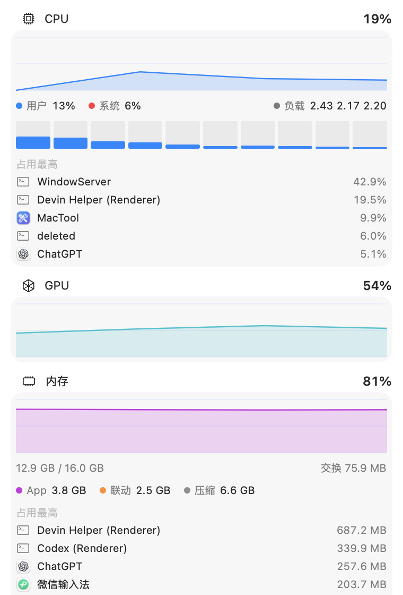

# MacTool

一个常驻 macOS 菜单栏的实用工具,Swift + SwiftUI 原生开发,无 Dock 图标,低资源占用。


## 截图

菜单栏(指标可自由组合):


| 监控 | 电池 |
|:---:|:---:|
|  |  |
| **清理** | **工具** |
|  |  |

## 功能

**菜单栏实时指标**(可自由组合)

- CPU、GPU、内存占用,网速(上下行),电池电量
- 小字指标名 + 数值,单图标宽度,紧凑美观

**系统监控**

- CPU 总占用 / 用户系统占比 / 每核负载 / 历史曲线
- GPU 占用曲线、内存拆分(App / 联动 / 压缩 / 交换)
- 磁盘容量与实时读写、网络速率曲线与累计流量
- 本机 IP、公网 IP、开机时长
- Top 5 CPU / 内存进程(带图标,右键可结束)

**电池**

- 电量、循环次数、健康度、设计/最大容量
- 电压、功率、适配器功率、剩余时间
- 充到 80% 通知提醒

**清理**

- 垃圾扫描:用户缓存、日志、Xcode DerivedData / 设备支持文件、模拟器缓存、npm 缓存
- 应用卸载:拖入 App,扫描 `~/Library` 残留,连同应用一起移入废纸篓(可恢复)
- 大文件查找
- 所有删除都走废纸篓,不会直接抹掉文件

**工具**

- 锁屏、显示隐藏文件、深色模式切换、防休眠(退出自动恢复)
- 清空废纸篓(经访达执行,含外接磁盘)
- 剪贴板历史(内存中,点击回粘)

## 安装

从 [Releases](https://github.com/hooleehub/MacTool/releases) 下载 `MacTool-x.x.x.dmg`:

1. 打开 DMG,把 **MacTool** 拖进"应用程序"文件夹
2. 首次打开如被 Gatekeeper 拦截:系统设置 → 隐私与安全性 → 找到 MacTool → **仍要打开**
3. 应用出现在菜单栏(顶部右侧),点击图标打开面板

> 安装包为 ad-hoc 签名,首次打开需手动放行一次,属正常现象。

## 权限说明

| 权限 | 用途 |
|---|---|
| 自动化 → 访达 | 清倒废纸篓 |
| 自动化 → 系统事件 | 切换深色模式 |
| 通知 | 80% 充电提醒 |

## 从源码构建

```bash
# 需要 Xcode 15+
xcodebuild -project MacTool.xcodeproj -scheme MacTool build

# 测试
xcodebuild -project MacTool.xcodeproj -scheme MacTool test

# 打包 DMG(通用二进制,Apple Silicon + Intel)
./scripts/package.sh
```

也可以直接用 Xcode 打开 `MacTool.xcodeproj`,Cmd+R 运行。

## 技术要点

- `MenuBarExtra`(.window 样式)面板 + `Settings` 场景
- Mach host APIs 采集 CPU / 内存,IOKit 读取电池
- 菜单栏 label 由 `ImageRenderer` 渲染为单张图片(系统文本 label 忽略字号)
- `caffeinate -w <pid>` 防休眠绑定进程生命周期
- 单实例保护:重复启动自动顶替旧实例

## License

MIT
